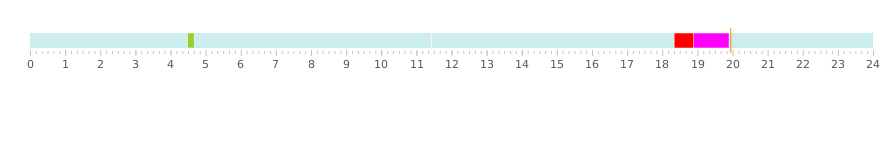

#### Javafx Timeline

###### usage

```
Timeline recordVisualiser = new Timeline(600,400);
RecordsLibrary library = new RecordsLibrary();
recordVisualiser.setRecordsLibrary(library);
recordVisualiser.populateRecords();

RecordClipNode recordClipNode = new RecordClipNode(TYPE.ALWAYS);
try {
    recordClipNode.addClips(new RecordClip(Paths.get("/one/1"),1538573159000L,1538576759034L,TYPE.ALWAYS));
    recordClipNode1.addClips(new RecordClip(Paths.get("/two/1"),1538521299000L,1538521959034L,TYPE.TIMED));
} catch (MaxClipGapException e) {
    e.printStackTrace();
}
RecordClipNode recordClipNode2 = new RecordClipNode(new RecordClip(Paths.get("/2"),1538571159000L,1538573159000L,TYPE.EMERGENCY));
RecordClipNode recordClipNode3 = new RecordClipNode(new RecordClip(Paths.get("/3"),System.currentTimeMillis(),System.currentTimeMillis()+60000,TYPE.ALARM));
library.addClipNode(recordClipNode,recordClipNode1,recordClipNode2,recordClipNode3);
AnchorPane pane = new AnchorPane(recordVisualiser); 
```


    

    
    